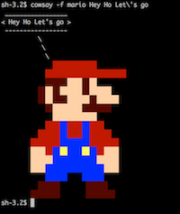

# cowsay
Couple of cows ([Mario](#mario) & [Luigi](#luigi)) + a [collection of cows](#cows) found around in a Docker Container

## TLDR;
- Copy cow files to the location where cows are kept in your OS.
    - On Mac OS 10.13x cows are at ```/usr/local/share/cows```
- You can clone this repository and copy the files undes ```cows/*``` to ```/usr/local/share/cows```
- You can also instal individual cows by using the [curl command below directly](#installing-via-curl), Tested on Mac OS, on other Operating better check;)
- Run it using: ```cowsay -f mario MESSAGE```
- Or just [run it from a container](#running-from-docker)

## Installing individual cows via curl
```bash
curl https://raw.githubusercontent.com/marcelocorreia/cowsay/master/my.cow \
    -o /path/to/your/cows/my.cow
```
#### Example
```bash
curl https://raw.githubusercontent.com/marcelocorreia/cowsay/master/mario.cow \
    -o /usr/local/share/cows/mario.cow
```

## Running from docker
```bash
$> docker run --rm -it marcelocorreia/cowsay -f mario Message!
```

## Mario
```bash
$> cowsay -f mario Hey Ho Let\'s go
```
or
```bash
$> docker run --rm -it marcelocorreia/cowsay -f mario Hey Ho Let\'s go
```


## Luigi
```bash
$> cowsay -f luigi Hey
```


# Cows

- C3PO
- R2-D2
- USA
- ackbar
- aperture-blank
- aperture
- armadillo
- atat
- atom
- awesome-face
- banana
- banjo-kazooie
- beavis.zen
- bees
- bender
- bill-the-cat
- biohazard
- bishop
- black-mesa
- blowfish
- bob
- bong
- box
- broken-heart
- bud-frogs
- bunny
- cake-with-candles
- cake
- cat
- cheese
- chessmen
- claw-arm
- clippy
- companion-cube
- cower
- cube
- daemon
- dalek-shooting
- dalek
- default
- dog
- dolphin
- dragon-and
- dragon
- elephant-in-snake
- elephant
- elephant2
- err
- explosion
- eyes
- fat-banana
- fat
- fire
- flaming-sheep
- fox
- gene
- ghost
- ghostbusters
- glados
- golden-eagle
- happy-whale
- head-in
- head
- hellokitty
- homer
- ignignokt
- jellyfish
- kilroy
- king
- kiss
- kitten
- kitty
- knight
- koala
- kosh
- lightbulb
- linda
- lobster
- lollerskates
- louise
- luigi
- luke-koala
- mailchimp
- mario
- maze-runner
- mech-and
- meeseeks
- meow
- milk
- mona-lisa
- moofasa
- mooninites
- moose
- mule
- mutilated
- nyan
- octopus
- owl
- pawn
- periodic-table
- personality-sphere
- pikachu
- pinball-machine
- prof
- pterodactyl
- queen
- radio
- ren
- rick-and-morty
- robot
- robotfindskitten
- roflcopter
- rook
- satanic
- seahorse-big
- seahorse
- sheep
- skeleton
- small
- smiling-octopus
- sodomized
- stegosaurus
- stimpy
- sudowoodo
- supermilker
- surgery
- taxi
- telebears
- template
- three-eyes
- threecubes
- tina
- toaster
- tortoise
- turkey
- turtle
- tux-big
- tux
- tweety-bird
- udder
- vader-koala
- vader
- walter
- weeping-angel
- whale
- world
- www
- yoda
- zoidberg
